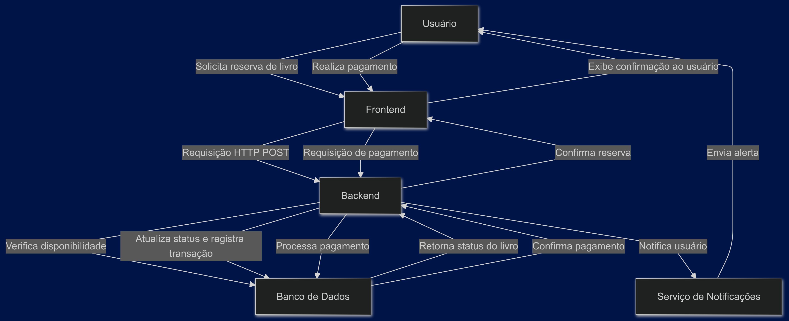

## 1. Visão Geral do Sistema
Objetivo: Criar uma experiência de uso prática e agradável, permitindo que os usuários gerenciem seus livros sem dificuldades, minimizando desistências devido a processos complexos. O sistema oferecerá ao administrador uma plataforma de controle completo para gerenciamento de livros, usuários, empréstimos, devoluções e notificações de atrasos.

Funcionalidades Principais:
- Navegação de fácil identificação
- Carteira e histórico de livros solicitados
- Reserva online
- Notificações de atraso
- Pagamento Seguro: Integração de um sistema de pagamento que garante transações seguras para usuários ao realizar reservas ou pagar por multas.

## 2. Componentes do Sistema

1. **Frontend (React):**
   - O React será utilizado para construir a interface do usuário, oferecendo uma interface interativa e amigável, com componentes reutilizáveis. Ele se comunica com o backend através de requisições HTTP, recebendo dados e enviando informações sobre as ações dos usuários, como reservas e consultas.

2. **Backend (Node.js com Express.js):**
   - O backend será construído em Node.js, utilizando o framework Express.js para criar uma API robusta. Ele processará as requisições vindas do frontend, executará a lógica de negócios necessária (como validações e manipulação de dados) e se comunicará com o banco de dados para armazenar ou recuperar informações.

3. **Banco de Dados (MySQL com Sequelize):**
   - Usaremos o MySQL como sistema de gerenciamento de banco de dados relacional, com Sequelize como ORM para facilitar o acesso e manipulação de dados. O backend enviará consultas SQL através do Sequelize, que se encarregará de traduzir as operações em comandos SQL, permitindo o armazenamento e recuperação de dados, como informações de livros e usuários.

4. **Testes da API (Postman/Insomnia):**
   - Utilizaremos Postman e Insomnia para testar a API, garantindo que todas as rotas funcionem corretamente. Essas ferramentas permitem que simulemos requisições para verificar se o backend responde conforme o esperado e se a integração com o banco de dados está funcionando.

5. **Controle de Versão (Git e GitHub):**
   - O Git será usado para controle de versão e o GitHub para colaboração entre os membros da equipe. Ele permitirá que todos os colaboradores acompanhem as mudanças no código, façam revisões e colaborem efetivamente no desenvolvimento do sistema.

6. **Transporte por Terceiros:**
   - Integração com serviços de transporte permitirá que os usuários solicitem o transporte de itens e rastreiem suas encomendas. O backend fará chamadas para APIs externas de transporte, facilitando a comunicação entre os usuários e os serviços de entrega.

7. **Gerenciamento:**
   - Haverá uma interface dedicada para gerenciar usuários, empréstimos, reservas e transportes, com funcionalidades para administração de usuários. Essa interface se comunicará com o backend para garantir que as informações sejam atualizadas e que os administradores possam gerenciar as operações da biblioteca com eficiência.

8. **Pagamento Seguro (PayPal):**
   - A integração de uma solução de pagamento permitirá transações seguras para reservas de livros e pagamentos de multas. O backend se comunicará com a API do serviço de pagamento, processando as transações e atualizando o banco de dados com informações sobre pagamentos realizados e pendentes.
     
## 3. Interações entre Componentes
### Comunicação entre Frontend e Backend

- **Requisições HTTP/REST:** O frontend, construído com React, comunica-se com o backend (Node.js com Express.js) por meio de requisições HTTP. As interações seguem o padrão REST, onde cada operação é mapeada para um verbo HTTP:
  - **GET:** Para buscar dados, como a lista de livros disponíveis.
  - **POST:** Para criar novos registros, como ao reservar um livro.
  - **PUT:** Para atualizar informações, como o status de um livro.
  - **DELETE:** Para remover registros, como ao cancelar uma reserva.

### Comunicação do Backend com o Banco de Dados e Serviço de Notificações

- **Banco de Dados:** O backend se conecta ao banco de dados MySQL utilizando o Sequelize como ORM (Object-Relational Mapping). O Sequelize simplifica a execução de consultas SQL e a manipulação de dados.

  - **Exemplo de interação:** Quando um usuário solicita a reserva de um livro, o backend verifica a disponibilidade do livro no banco de dados, atualiza seu status e registra a transação, exemplo logo abaixo.

- **Serviço de Notificações:** O backend se integra a um serviço externo de notificações (como Twilio ou Firebase Cloud Messaging) para enviar alertas sobre devoluções pendentes ou atrasos. As requisições para esse serviço seguem a arquitetura RESTful, semelhante às interações entre o frontend e o backend.

1. **O usuário acessa a interface do sistema.**
   - O usuário abre o site e acessa a página inicial.

2. **O Frontend (React) é carregado.**
   - A interface inicial é exibida ao usuário.

3. **O usuário realiza uma pesquisa.**
   - O Frontend envia uma requisição HTTP GET ao Backend (Node.js com Express.js) para buscar a lista de livros disponíveis.

4. **O Backend retorna a lista de livros.**
   - O Backend acessa o Banco de Dados (MySQL com Sequelize), busca os livros disponíveis e retorna a lista ao Frontend.

5. **O usuário seleciona um livro para reserva.**
   - O usuário clica em um livro e o Frontend envia uma requisição HTTP POST ao Backend para solicitar a reserva do livro.

6. **O Backend verifica a disponibilidade do livro.**
   - O Backend consulta o Banco de Dados para verificar se o livro está disponível. Se sim, atualiza o status do livro para "reservado" e registra a transação.

7. **O usuário realiza o pagamento seguro da reserva ou multa.**
   - O Frontend direciona o usuário para uma página de pagamento, onde ele pode inserir os dados de pagamento. O Frontend então envia uma requisição ao Backend para processar o pagamento.

8. **O sistema envia alertas sobre livros atrasados.**
   - Se um livro estiver atrasado, o Backend utiliza um serviço de notificações para enviar alertas ao usuário.

9. **O administrador registra novos livros e gerencia usuários.**
   - O administrador acessa uma interface de gerenciamento no Frontend, onde pode adicionar novos livros e gerenciar informações dos usuários. O Frontend envia requisições ao Backend para essas operações.

10. **Coleta de opiniões para melhorar a experiência.**
    - O Frontend fornece um formulário de feedback onde os usuários podem enviar suas opiniões. As informações são enviadas ao Backend e armazenadas para futuras melhorias no sistema.
   
## 3.2 Diagrama de Fluxo de dados 
### Operação de um empréstimo de um livro.

## 4. Decisões de Tecnologia

### 4.1 Frontend
**Decisão:** Usar React para o frontend.  

**Justificativa:** O React é excelente para criar interfaces dinâmicas e interativas, proporcionando uma boa experiência ao usuário. Além disso, sua arquitetura baseada em componentes facilita a reutilização de código e a manutenção do sistema.  

**Alternativa Rejeitada:** Considerei o Angular, mas sua curva de aprendizado mais acentuada e estrutura rígida não se adequavam à flexibilidade que buscamos.

### 4.2 Backend
**Decisão:** Utilizar Node.js com Express.js para o backend.  

**Justificativa:** Essa combinação é ideal para construir APIs escaláveis e robustas rapidamente. A utilização de JavaScript tanto no frontend quanto no backend permite uma integração mais fluida entre as equipes.  

**Alternativa Rejeitada:** Considerei usar o PHP com Laravel, mas o desempenho do Node.js em aplicações assíncronas é fundamental para a responsividade do sistema.

### 4.3 Banco de Dados
**Decisão:** Optar pelo MySQL como banco de dados relacional.  

**Justificativa:** O MySQL assegura a integridade dos dados e é confiável para gerenciar relações complexas, como as entre usuários e empréstimos. Sua ampla adoção facilita o acesso a suporte e documentação.  

**Alternativa Rejeitada:** Considerei o MongoDB, mas como banco de dados NoSQL, ele não atende às necessidades de relações complexas que o sistema exige.

### 4.4 ORM
**Decisão:** Utilizar Sequelize como ORM.  

**Justificativa:** O Sequelize simplifica a interação com o banco de dados, permitindo que os desenvolvedores trabalhem com objetos, o que torna o código mais limpo e minimiza erros comuns de SQL.  

**Alternativa Rejeitada:** Avaliei usar Mongoose, mas a simplicidade e popularidade do Sequelize facilitarão a colaboração e o suporte da equipe.

### 4.5 Testes de API
**Decisão:** Escolher Postman e Insomnia para testes de API.  

**Justificativa:** Ambas as ferramentas são intuitivas e eficazes para validar se todas as rotas da API estão funcionando corretamente, garantindo a qualidade do sistema antes do lançamento.  

**Alternativa Rejeitada:** O uso de JMeter foi avaliado, mas sua complexidade é desnecessária para as necessidades atuais de testes.

### 4.6 Controle de Versão
**Decisão:** Usar Git e GitHub para controle de versão.  

**Justificativa:** O Git permite gerenciar as alterações no código de forma eficiente, enquanto o GitHub facilita a colaboração entre os membros da equipe, que é essencial para o sucesso do projeto.  

**Alternativa Rejeitada:** O Bitbucket foi considerado, mas o GitHub é mais amplamente utilizado e oferece uma comunidade mais ativa, além de recursos robustos.

### 4.7 Integração com Serviços de Transporte
**Decisão:** Integrar serviços de transporte ao sistema.  

**Justificativa:** Essa integração permitirá que os usuários solicitem transporte de itens e rastreiem suas encomendas, aumentando a conveniência e eficiência do sistema.  

**Alternativa Rejeitada:** A ideia de não incluir um sistema de transporte foi considerada, mas isso limitava as funcionalidades do sistema e a experiência do usuário.

### 4.8 Gerenciamento de Usuários
**Decisão:** Criar uma interface dedicada para o gerenciamento de usuários.  

**Justificativa:** Essa interface é crucial para permitir que administradores gerenciem permissões e a segurança do sistema.  

**Alternativa Rejeitada:** O gerenciamento manual de usuários, sem uma interface, foi considerado, mas seria ineficiente e propenso a erros.

### 4.9 Pagamento Seguro
**Decisão:** Integrar uma solução de pagamento seguro, como PayPal ou Stripe.  

**Justificativa:** Isso oferece segurança nas transações financeiras e aumenta a confiança dos usuários ao realizar pagamentos.  

**Alternativa Rejeitada:** A opção de não implementar um sistema de pagamento foi considerada, mas isso comprometeria a funcionalidade essencial do sistema de gerenciamento de empréstimos e reservas.

## 5. Requisitos e Restrições

### Requisitos Funcionais:
- O sistema deve permitir que administradores cadastrem livros e usuários, além de gerenciar suas informações.
- Deve facilitar a realização de empréstimos e reservas de livros, com atualizações automáticas de disponibilidade.
- É necessário enviar notificações sobre atrasos e permitir pagamentos seguros de multas.
- O sistema deve fornecer acesso a relatórios e estatísticas sobre o uso, como empréstimos e reservas.

### Requisitos Não Funcionais:
- O sistema deve suportar até 100 usuários simultâneos, garantindo uma experiência estável durante picos de acesso.
- É fundamental proteger dados sensíveis com criptografia e implementar autenticação robusta para acesso ao sistema.
- A interface deve ser amigável e intuitiva, facilitando a navegação dos usuários.
- O sistema deve ser escalável e compatível com diferentes dispositivos e navegadores, assegurando uma experiência consistente.
- Deve incluir medidas de segurança para transações financeiras, como autenticação em duas etapas e conformidade com PCI DSS (Padrão de Segurança de Dados da Indústria de Cartões de Pagamento).
